# Fork仓库指南

# 参考文章

> [GitHub Pull request 并且与「原仓库」同步解决代码冲突](https://zhuanlan.zhihu.com/p/337949346)
>
> [git同步fork仓库同步upstream仓库](https://blog.csdn.net/weixin_43923436/article/details/121613677)

# 学习目标

+ fork仓库以及提出Pull Request。
+ 仓库主分支同步fork仓库代码的更新。
+ 仓库创建新分支，同步主分支代码和维护新分支专属代码不与主分支冲突。

# fork仓库以及提出Pull Request

>  fork仓库地址：https://github.com/iPeiPig/TestFork

## fork仓库

+ 浏览器打开fork仓库地址，点击右上角的Fork按钮。

  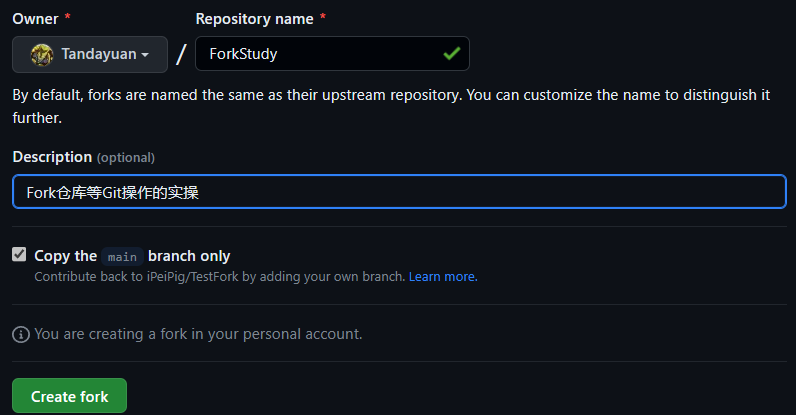

+ 本地克隆仓库`git clone https://github.com/Tandayuan/ForkStudy`

## 提出Pull Request

+ 本地仓库修改README.md文件、提交到远程仓库。

  

+ 在GitHub提出Pull Request

  检查到没有代码冲突，Pull Request成功，等待Fork仓库管理员审核通过，Fork仓库就会显示刚才提交的代码。

  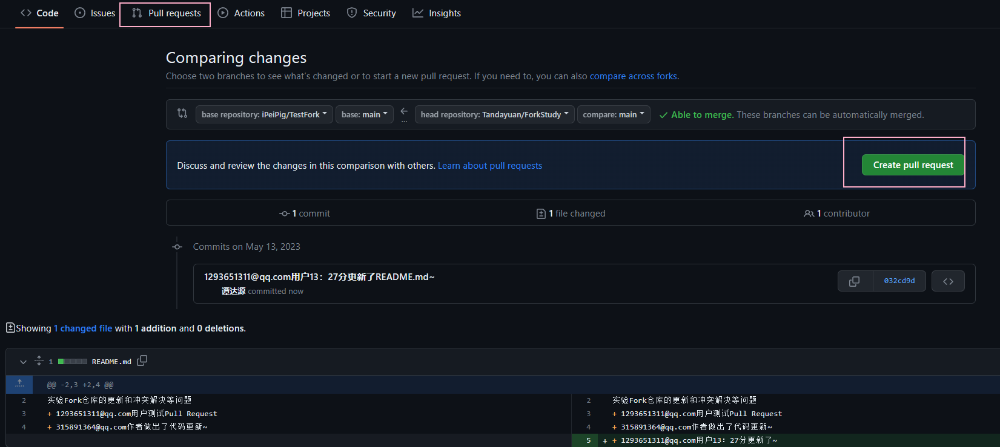

  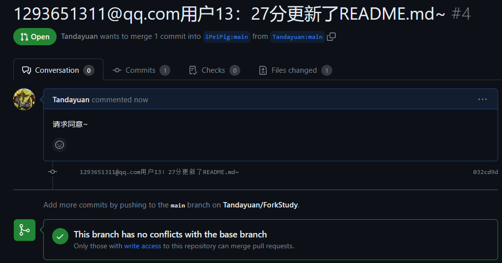

+ 模拟管理员审核通过刚才的Pull Request

  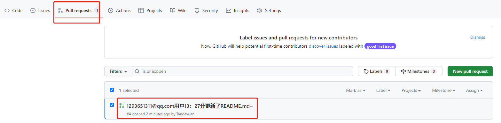

  

  同意以后Fork仓库就会出现审核通过的代码：

  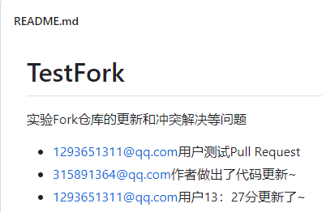

# 仓库主分支同步fork仓库代码的更新

如果fork仓库作者做出了代码变动，我们可以通过设置upstream的方式手动同步更新仓库中的代码，保持一致。

+ 模拟fork仓库作者更新代码：

  

+ 本地仓库设置upstream(上游仓库)：

  + 查看远程仓库状态，如果只有如下两条记录，说明本地仓库没有设置upstream：

  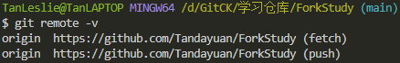

  + 设置upstream为fork仓库：

  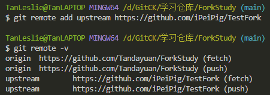

+ 拉取和合并upstream仓库的代码到本地仓库：

  + 拉取：fork仓库的main分支代码已经拉取到本地的上游仓库main分支

  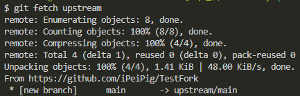

  + 合并：上游仓库main分支的代码合并到本地仓库的main分支中，可以看到本地仓库代码发生变化

  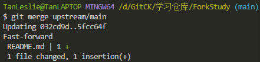

+ 本地仓库推送代码到远程仓库：

  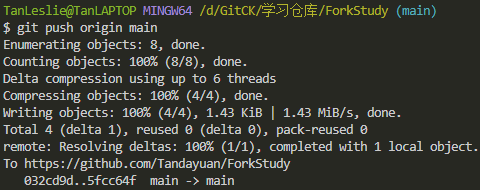

+ 远程仓库查看代码已经更新：

  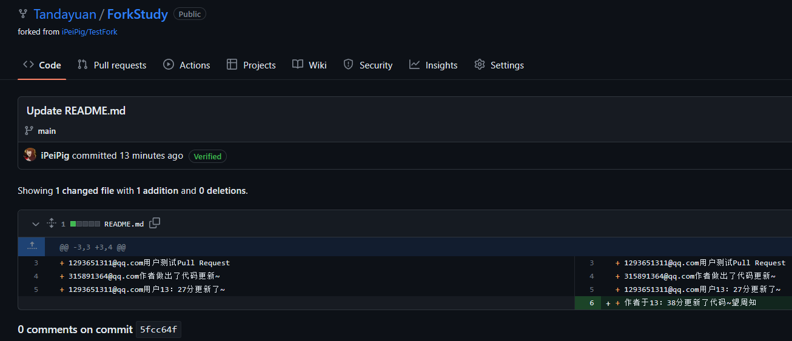

# 仓库创建新分支，同步主分支代码和维护新分支专属代码不与主分支冲突

## 本地仓库创建新分支

+ 分支名称：patch；创建并切换到patch分支；

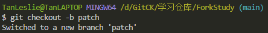

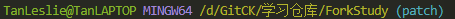

+ 推送本地新建分支到远程仓库：

  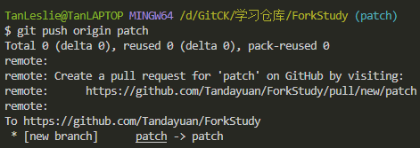

  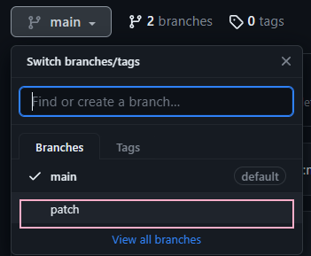

## 同步主分支代码到新分支

+ 由于主分支代码和fork仓库的主分支代码保持一致，所以需要按上述步骤模拟fork仓库更新。

  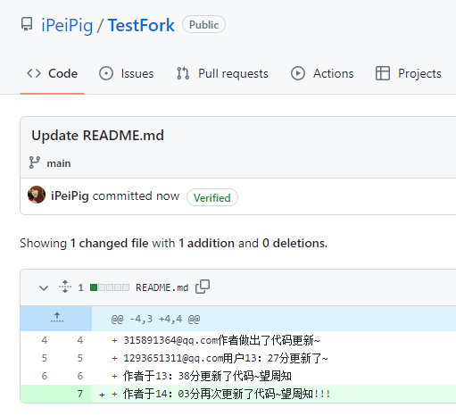

+ 切换到本地仓库主分支更新代码：

  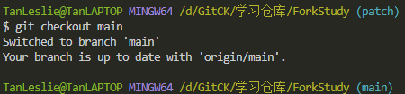

  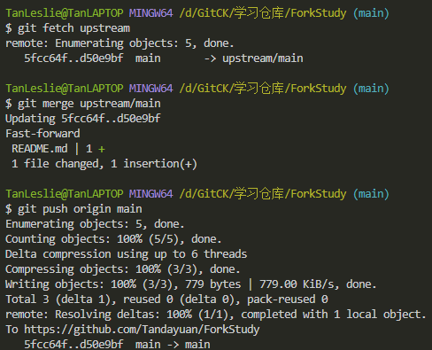

+ 切换到新分支合并主分支代码：

  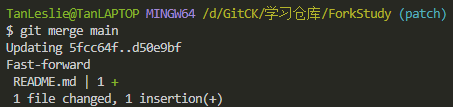

+ 推送本地仓库新分支代码到远程仓库新分支：

  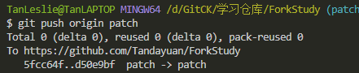

  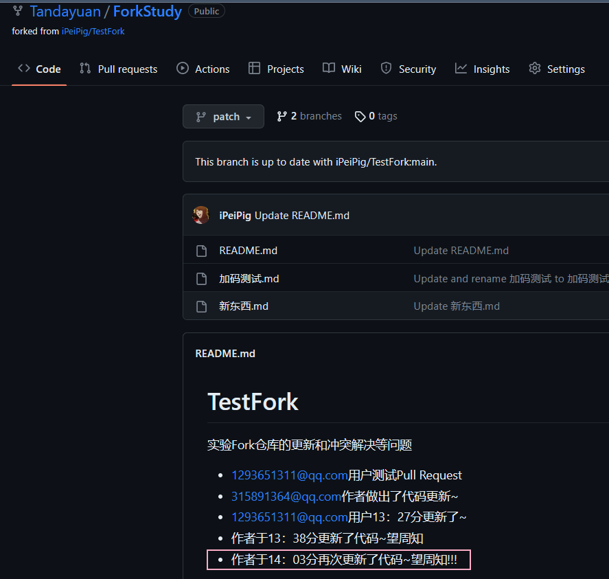

## 维护新分支专属代码不与主分支冲突

+ 修改本地仓库新分支代码：

  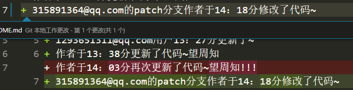

+ 推送到远程仓库，更新新分支代码：

  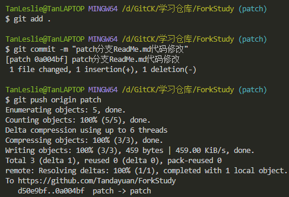

+ 模拟主分支更新同一行代码：

  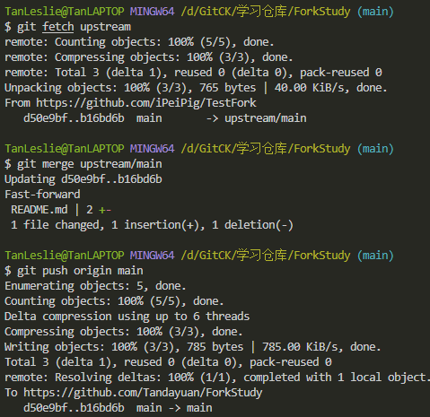

  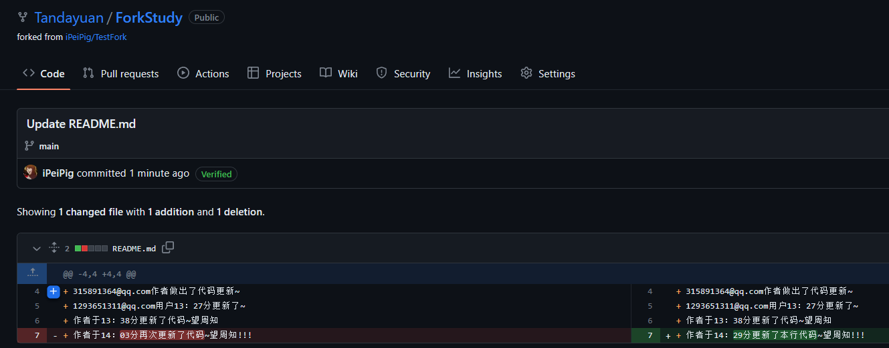

+ 新分支合并主分支代码引发冲突，选择保留当前更改解决冲突：

  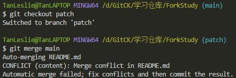

  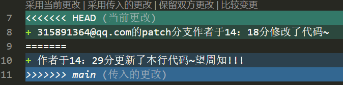

+ 再次commit解决冲突，推送更新远程仓库patch分支代码：

  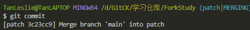

  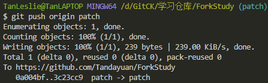